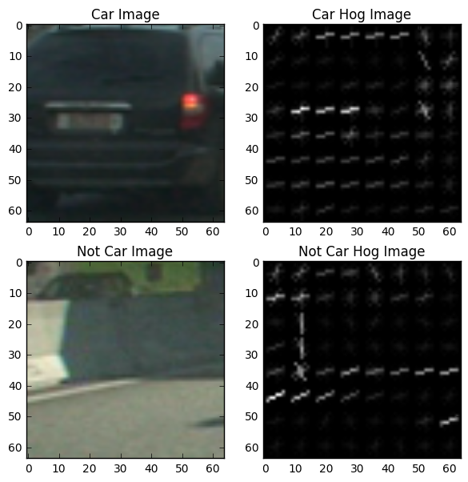
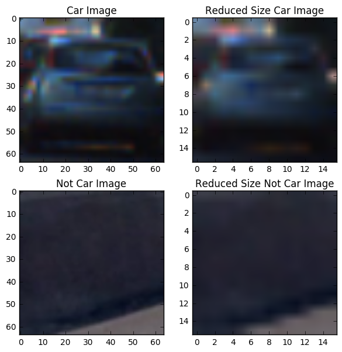
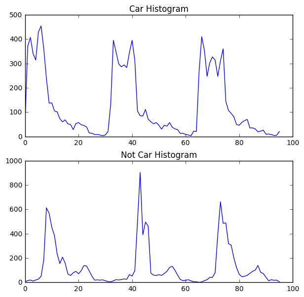
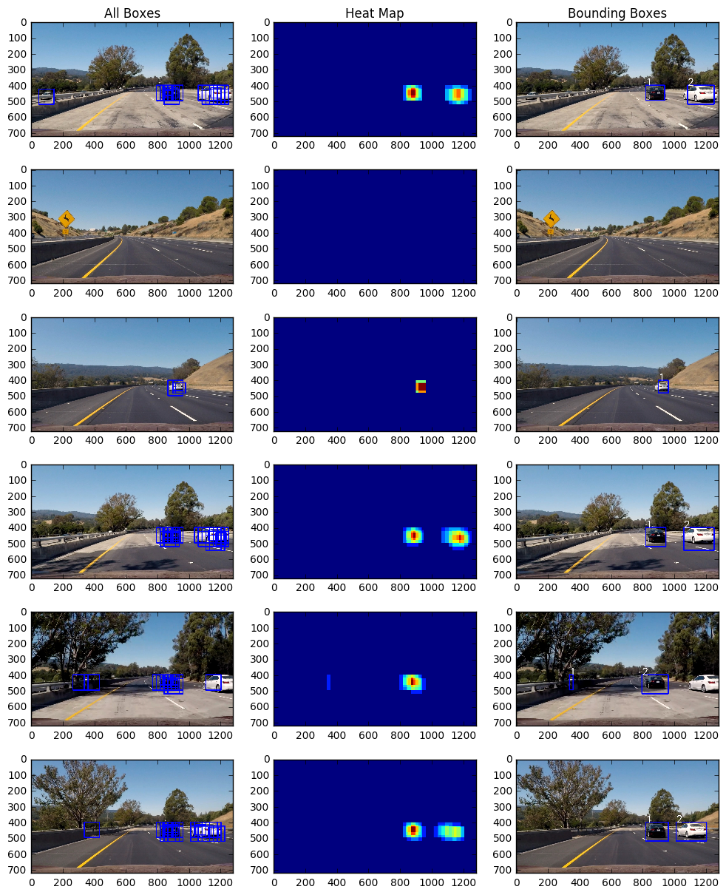

# Udacity Self-Driving Car Nanodegree
# Project #5: Vehicle Detection

## Introduction
This is a project for Udacity's Self-Driving Car Nanodegree. It uses computer vision techniques to detect other vehicles on the road in a video feed from a forward-facing camera.

## Concepts and Classes
Concepts explored in this project:

  - Color spaces and their relative advantages/disadvantages
  - Spatial binning
  - Color histograms
  - Histograms of Oriented Gradients (HOG)
  - Image classification using support vector machines
  - Using moving windows to search for images

## Getting Started
To view the project video, click [here](https://youtu.be/uu2P16EPm1Y).

To view the code, open `vehicleDetection.html` in a web browser.

To view and run the code, open `vehicleDetection.ipynb` in a Jupyter Notebook. You'll need to download [vehicle](https://s3.amazonaws.com/udacity-sdc/Vehicle_Tracking/vehicles.zip) and [non-vehicle training](https://s3.amazonaws.com/udacity-sdc/Vehicle_Tracking/non-vehicles.zip) training images and save them to a folder titled `training_images`. You also need the following libraries installed:

  - Python 3
  - `IPython`
  - `numpy`
  - `cv2`
  - `glob`
  - `matplotlib`
  - `moviepy`
  - `sklearn`

The output video is saved as `output_video.mp4`

## Histograms of Oriented Gradients (HOG) Features

I calculated HOG features for images using the `sklearn.feature.hog` method, using the following parameters:

  - 9 bins for gradient orientations, which is shown [here](http://lear.inrialpes.fr/people/triggs/pubs/Dalal-cvpr05.pdf) to be the optimal number for a similar classification problem.
  - 8x8 pixel per cell, which is an appropriate number given the size of the features we're looking for in the image (~8x8 pixels)
  - 2x2 cells per block, which gives a good local normalization for gradients in each block

Also, HOG features capture gradients, so I converted the original RGB images to YCrCb - YCrCb puts most of the visibility information (luminance) in the Y channel, and the color information in the Cr (chroma red) and Cb (chroma blue) channels, while maintaining the original shape of the image in all three channels. This helps to emphasize the gradients in the image.

Examples of car and not-car images show below with their respective HOG images, in which gradient features are clearly visible.

## Spatial Binning

I converted the 64x64 training images to 16x16 images, and unraveled those to extract spatial binning features. Converting to 16x16 reduces the feature vector size, while still maintaining the relevant features of the images (show below).

## Color Histograms

I took the color histograms for each channel in each image, using 32 bins for the histograms. This captures information related to the prevalence of certain colors in an image, without regard to position within the image.

Color histograms (in YCrCb) for car and not-car images show below.

## Training the classifier

I extracted spatial, color histogram, and HOG features. This gives a feature vector of length 6156 features, so I chose to train a LinearSVC classifier on the data. This was because a) support vector machines are robust to data with large numbers of features, and b) once trained, prediction is relatively fast, and the classifier needs to be able to work in real time.

I chose to convert images to YCrCb color space, because (as previously mentioned) it helps in capturing gradients while maintaining the shape of the image in all 3 channels. I confirmed this by training the classifier with different color spaces, and the YCrCb gave the highest classification accuracy, which was over 99%.

I also tested different values of the C parameter for the LinearSVC - the C parameter is a penalty for misclassification, and generally corresponds the bias/variance tradeoff for classification, where a lower C value gives a higher bias model, and a higher C value gives a higher variance model. From this, I found a C value of 10 gave the highest classification accuracy.

## Finding cars in a video frame

Once the classifier was trained, the next step was to find cars in test video frames. The simplest way to do this is to define moving windows of different sizes to scan the region where cars are expected to be found (the bottom half of the image), extract features in the same way that images were extracted, and use the classifier to predict whether or not that window contains a car.

One drawback to this approach is that finding HOG features is computationally expensive, so instead, HOG features are calculated once for the whole image, and then those features are stepped through to find HOG features. Different window sizes are simulated by resizing the whole image before finding HOG features.

Spatial binning and color histogram features are found by correlating the location of the window in the HOG image with the location of the window in the original pixel image.

I used windows of size 64x64 pixels and 96x96 pixels, since these two combined consistently found the cars while generally avoiding false positives.

## Heat Mapping and Labeling

I used heat mapping and thresholding to identify true positives and eliminate false positives. Each positive window adds +1 "heat" to all its pixels in a heat map image, and once all windows are cycled through, any pixels with a heat below a certain threshold are eliminated. This is effective in removing false positives, as well as separating individual cars into contiguous regions of high heat.

Once thresholding was applied, I used `scipy.ndimage.measurements.label` to label all the contiguous regions on the heat map (which correspond to individual cars), and drew bounding boxes around each region. I also added the label number on top of each car to show the continuity of cars between frames, and to show how many regions are identified in the frame.

Box images, heat maps, and labeled bounding box images show below.

## Testing on Video

Since it takes a while to process the output video, I found it efficient to break the project video into 10 second clips for testing. This helped when I only wanted to test changes to the pipeline on certain pieces of the video.

Also in the actual video stream, I smoothed out the predictions by using a moving average of 20 frames for heat mapping before thresholding.

## Discussion/Areas for Improvement

The classifier tracks all cars fairly reliably on the project video. The biggest issue is that it doesn't detect cars just as they are entering the field of vision from the side, and only detects them once they moved quite a bit onto the frame. This is most likely because of the training data used for the classifier - almost all the training images for cars were taken from behind the car, rather than to the side. More training data that fits this case would likely solve this problem.

Another less important issue is that the classifier loses track of individual cars when they overlap, since overlapping heat map regions don't differentiate between cars. This could be solved perhaps with training classifiers for different color cars (perhaps one for black, and one for white), and using more robust logic to keep track of cars when they are occluded.
